# sc-Isoform COTAN

[](https://github.com/ldelitala/sc-isoform-cotan/actions/workflows/lint.yaml)
[](LICENSE)

## What this is

This repository is the code behind a bachelor's thesis that asks whether
**differential transcript usage (DTU)** can be recovered from single-cell RNA-seq
data using **COTAN**, a co-expression method based on zero-count statistics. The
thesis runs on transcript (isoform) level, not gene level.

COTAN is adapted here from gene level to **transcript level**: a filtered
cell-by-isoform count matrix is produced by a Nextflow pipeline, then COTAN is
run on it to detect, within a parent gene, pairs of transcripts that switch their
relative usage across cell clusters. The candidate pairs form the DTU tables the
thesis reports. See [`docs/dtu_methods.md`](docs/dtu_methods.md) for the exact
definition.

> Authoritative overview: this file. The downstream R analysis is documented in
> [`analysis/README.md`](analysis/README.md). `docs/` holds design notes, some
> historical — see [`docs/README.md`](docs/README.md) for which is current.

## Data flow

```mermaid
graph LR
  A["SRA accessions (.csv)"] --> B["download<br/>src/pipeline/bin/1.x"]
  B --> C["index<br/>src/pipeline/bin/2.x"]
  C --> D["align + QC<br/>nf-core/scrnaseq + simpleaf"]
  D --> E["raw_matrix.seurat.rds"]
  E --> F["filter_matrix.R"]
  F --> G["*_filtered.rds"]
  G --> H["analysis/: COTAN object"]
  H --> I["coex -> GDI -> clustering -> DEA"]
  I --> J["DTU candidates"]
```



Two independent units meet at one artifact, a filtered transcript-level matrix
(`*_filtered.rds`): the Nextflow half **produces** it, the `analysis/` half
**consumes** it.

## Repository layout

| Path | Role |
| :--- | :--- |
| `cotanisoform/` | The R package with the COTAN/Seurat/logging algorithms. Source of truth. |
| `analysis/` | The downstream driver steps (`00`–`08`), one YAML per dataset + level. See [`analysis/README.md`](analysis/README.md). |
| `src/pipeline/` | The Nextflow half: `main.nf`, `nextflow.config`, `modules/`, `subworkflows/`, `bin/` stage scripts. |
| `envs/` | Conda environments for athena (`analysis.yml`, `pipeline.yml`). See [`envs/README.md`](envs/README.md). |
| `scripts/` | `install_deps.R` (pins COTAN), `verify_dtu_parity.R` (result parity check), `collect_results.sh`. |
| `results/` | Curated published outputs. See [`results/README.md`](results/README.md). |
| `docs/` | Design docs and reference material; `docs/legacy/` is historical. |
| `src/libs/` | **Superseded; pending deletion (S7).** The old `project.*` / `deli.*` packages, kept only until the cleanup finishes. Do not build on them. |

## Installation

The analysis runs in conda on the university machine (athena). COTAN itself is
installed from a pinned GitHub commit, not from conda.

```bash
conda env create -f envs/analysis.yml      # R 4.5.3 + R libraries
conda env create -f envs/pipeline.yml      # Nextflow launcher + JDK + pigz

conda activate cotanisoform-analysis
Rscript scripts/install_deps.R             # installs COTAN 2.13.1 @ be93aa8
R CMD INSTALL cotanisoform                 # this repository's package
```

## Quick start

### Nextflow half — produce a filtered matrix

Each dataset has a run directory **on athena** under `runs/<dataset>/`
containing `run_pipeline.sh`, `samplesheet.csv`, `nextflow.config` and
`custom.config`. The script is run **from inside that directory** so
`launchDir` resolves the output paths (`runs/` is gitignored and exists only on
athena):

```bash
cd runs/<dataset>
./run_pipeline.sh        # -> nextflow run .../src/pipeline/main.nf \
                         #      -c nextflow.config -profile singularity -resume
```

`--step` selects `download`, `index` or `align`; `align` is the default and runs
the full chain. The samplesheet is a CSV with columns `sample,sra`.

### Analysis half — extract DTU candidates

From the repository root, with `cotanisoform` installed:

```bash
Rscript analysis/run_all.R --config analysis/config/arrigoni.yaml
Rscript analysis/run_all.R --config analysis/config/ding_cortex_2.transcript.yaml --from 07 --to 08
Rscript analysis/run_all.R --config analysis/config/arrigoni.yaml --dry-run   # resolve paths only
```

Add `--out-dir /tmp/scratch` to write to scratch and shadow configured inputs —
the published tables are never overwritten. Only step `07_dtu.R` produces the
reported DTU tables. Full option reference in
[`analysis/README.md`](analysis/README.md).

## Results

The reported DTU candidate tables and diagnostic plots are in
[`results/`](results/README.md). They can be re-checked against the stored COTAN
objects with:

```bash
Rscript scripts/verify_dtu_parity.R      # on athena; must print "3/3 cases reproduced exactly"
```

## Data availability

Public datasets, GEO accessions, genome builds and re-download instructions are
in [`docs/data_availability.md`](docs/data_availability.md). Third-party papers
are cited, not redistributed; the COTAN paper and documentation PDFs are **not**
shipped in this repository.

## Citation

If you use this software, cite the associated bachelor's thesis — see
[`CITATION.cff`](CITATION.cff). The thesis sources are at
<https://github.com/ldelitala/cotan-dtu-thesis>.

<!-- TODO(supervisor): add ORCID iDs and/or a DOI here when available. -->

## Licence

[GPL-3.0](LICENSE).

## Acknowledgements

Supervisors: Prof. Silvia Galfré and Prof. Corrado Priami, University of Pisa,
Department of Computer Science.

---

## Reference: the Nextflow half in detail

### Steps

| Step | What it does |
| :--- | :--- |
| `download` | Fetch FASTQs/BAMs for the accessions in the samplesheet |
| `index` | Download Ensembl FASTA/GTF and build a simpleaf (Piscem) index |
| `align` | `download` + `index` as needed, then run `nf-core/scrnaseq` and QC-filter (default) |

`main.nf` accepts only these three (`valid_steps`); there is no `all`/`filter`
step. `align` runs `PREPROCESSING` = `ALIGN_SIMPLEAF` then `QC_FILTER`.

### Stage scripts

| Process | Script (`src/pipeline/bin/`) | Notes |
| :--- | :--- | :--- |
| `CHECK_LAYOUT` | `1.1_ingest_check_layout.sh` | Queries ENA API → `SINGLE`/`PAIRED` |
| `DOWNLOAD_BAM` | `1.2_ingest_download_bam.sh` | `prefetch --type TenX` + `bamtofastq` |
| `DOWNLOAD_FASTQ` | `1.3_ingest_download_fastq.sh` | `prefetch` + `fasterq-dump` + `pigz` |
| `DOWNLOAD_REFERENCE` | `2.1_index_download_reference.sh` | Ensembl download, `primary_assembly`→`toplevel` fallback |
| `BUILD_INDEX` | `2.2_index_build_index.sh` | `simpleaf index` |
| `APPLY_TRANSCRIPT_CHEAT` | `2.3_index_apply_cheat.sh` | Identity `t2g` + `mt_transcripts.txt` extraction |
| `QC_FILTER` | `filter_matrix.R` + `lib_qc.R` + `lib_io.R` | Per-cell QC filtering |

### The transcript "cheat"

To get a **cell-by-isoform** matrix, `2.3_index_apply_cheat.sh`:

1. Rewrites `t2g_3col.tsv` so each transcript maps to **itself** (isoforms stop
   collapsing into genes).
2. Deletes `gene_id_to_name.tsv` so `nf-core/scrnaseq` skips gene-symbol
   annotation and keeps Ensembl transcript IDs (`ENSMUST…`/`ENST…`) as rows.
3. Writes `mt_transcripts.txt` (mitochondrial transcript IDs) into the index —
   required later by QC, because the regex `^MT-|^mt-` **never** matches
   transcript IDs.

### QC filtering (R)

- Computes per-cell `nFeatures`, `nCounts`, `percent_mt`.
- Mitochondrial detection uses `mt_transcripts.txt` when provided (required for
  transcript-level matrices); falls back to `^MT-|^mt-` for gene-level.
- Thresholds (`nextflow.config`): `min_features=200`, `max_features=8000`,
  `min_counts=500`, `max_percent_mt=10.0`.
- Writes `<sample>_filtered.rds` (a list with `matrix` + `metadata`).

### Containers

- Index build: `simpleaf:0.24.0--hd612981_1` (`modules/index.nf`)
- Child alignment/quant: `simpleaf:0.24.1--hd612981_0` (`modules/align.nf`)
- `nf-core/scrnaseq` pinned to **4.1.0**, launched as a child Nextflow run inside
  an `exec:` block with `NXF_SYNTAX_PARSER=v1`.

### Gotchas

- **COTAN p-value segfault.** `COTAN::calculatePValue()` segfaults at ≥46,341
  features (32-bit overflow when subsetting `dspMatrix`); keep features < ~41,000.
  See [`docs/cotan_pvalue_segfault.md`](docs/cotan_pvalue_segfault.md).
- **`runs/` and all data are gitignored** (`data/`, `runs/`, `.conda/`,
  `.cache/`, `COTAN/`, `logs/`). Only code and docs are versioned.
- **RAM-disk policy.** Downloads stage in `/dev/shm` (`scratch '/dev/shm'`);
  never write raw SRA/BAM to persistent disk.
- **`central.config.example` is illustrative only** — the real override is the
  per-run `nextflow.config` (`-c`) plus `custom.config` for the child pipeline.
- **Docs drift.** Older `docs/*.md` describe steps `all`/`filter`, old parameter
  names (`srr_ids`, `index_dir`, `genome`) and an outdated simpleaf container tag — they now live
  under `docs/legacy/`. Trust this README and the code over them.

### Working on this project

This clone is synced to athena over git (`git pull` → edit → `git push`; athena's
tree updates in place). Heavy runs happen only on athena. Before changing a stage
script, check its Nextflow caller for the exact argument order
(`src/pipeline/modules/*.nf`). R style is 2-space indent, 120-column limit
(`.lintr.R`); a new exported function needs `@export` plus regenerated
`NAMESPACE` and `man/*.Rd`.
