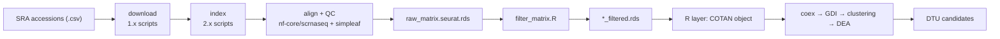

# sc-Isoform COTAN pipeline

Thesis project: adapt **COTAN** (co-expression / zero-count statistics) from
gene-level to **transcript (isoform) level** to detect **differential transcript
usage (DTU)** in scRNA-seq data. The codebase has two halves:

1. **Nextflow pipeline** (`src/pipeline/`) — turns public SRA accessions into
   transcript-level count matrices on the university machine **Athena**
   (`/data/lorenzo_delitala`, 88 cores / ~2 TB RAM).
2. **R analysis layer** (`src/libs/`) — runs COTAN on those matrices and
   extracts DTU candidates.

> Authoritative overview: this file. `docs/` holds design notes that are partly
> historical — see [docs/README.md](docs/README.md) for which is current.

---

## 1. Data flow



Two independent units of code: the Nextflow half **produces** a filtered
transcript-level matrix; the R half **consumes** it. They meet at
`*_filtered.rds`.

---

## 2. Repository map

| Path | Role |
| :--- | :--- |
| `src/pipeline/main.nf` | Nextflow DSL2 entry point |
| `src/pipeline/nextflow.config` | Base params + default resources |
| `src/pipeline/subworkflows/` | `download`, `index`, `preprocessing` orchestration |
| `src/pipeline/modules/` | Processes: `ingest`, `index`, `align`, `filter` |
| `src/pipeline/bin/` | Stage scripts: `1.x` ingest, `2.x` index, `filter_matrix.R` + `lib_*.R` |
| `src/pipeline/utils/` | `helpers.nf` (validation/webhook), `init.nf` (startup banner) |
| `src/libs/project.*` | Integrated COTAN/Seurat/logging packages (current driver uses these) |
| `src/libs/deli.*` | Refactor target of the same packages (in progress) |
| `src/scripts/install_cotan.R` | Installs COTAN from `seriph78/COTAN` |
| `src/tmp_*.R`, `src/clean.R` | Scratch drivers with hardcoded paths (not library code) |
| `results/` | Curated analysis outputs (DTU tables, plots, logs, scripts) — see [results/README.md](results/README.md) |
| `scripts/collect_results.sh` | Stages the curated result subset on Athena for publishing |
| `docs/` | Design docs — partly stale, see `docs/README.md` |
| `central.config.example` | Example high-resource overrides (not the actual mechanism) |

---

## 3. Nextflow half

**Entry point:** `src/pipeline/main.nf`. Three steps via `params.step`:

| Step | What it does |
| :--- | :--- |
| `download` | Fetch FASTQs/BAMs for the accessions in the samplesheet |
| `index` | Download Ensembl FASTA/GTF and build a simpleaf (Piscem) index |
| `align` | `download` + `index` as needed, then run `nf-core/scrnaseq` and QC-filter (default) |

`align` is the only step that runs the whole thing end to end: `PREPROCESSING`
contains `ALIGN_SIMPLEAF` followed by `QC_FILTER`. There is no `all`/`filter`
step — old docs mentioning them are stale.

### Samplesheet
CSV with header, columns **`sample,sra`** (one row per SRR accession; several
rows can share a `sample`). Set via `params.input`.

### Stage scripts
| Process | Script | Notes |
| :--- | :--- | :--- |
| `CHECK_LAYOUT` | `1.1_ingest_check_layout.sh` | Queries ENA API → `SINGLE`/`PAIRED` |
| `DOWNLOAD_BAM` | `1.2_ingest_download_bam.sh` | `prefetch --type TenX` + `bamtofastq` |
| `DOWNLOAD_FASTQ` | `1.3_ingest_download_fastq.sh` | `prefetch` + `fasterq-dump` + `pigz` |
| `DOWNLOAD_REFERENCE` | `2.1_index_download_reference.sh` | Ensembl download, `primary_assembly`→`toplevel` fallback |
| `BUILD_INDEX` | `2.2_index_build_index.sh` | `simpleaf index` |
| `APPLY_TRANSCRIPT_CHEAT` | `2.3_index_apply_cheat.sh` | Identity `t2g` + `mt_transcripts.txt` extraction |
| `QC_FILTER` | `filter_matrix.R` | See §4 |

### The transcript "cheat"
To get a **cell-by-isoform** matrix, `2.3_index_apply_cheat.sh`:
1. Rewrites `t2g_3col.tsv` so each transcript maps to **itself** (isoforms stop
   collapsing into genes).
2. Deletes `gene_id_to_name.tsv` so `nf-core/scrnaseq` skips gene-symbol
   annotation and keeps Ensembl transcript IDs (`ENSMUST…`/`ENST…`) as rows.
3. Writes `mt_transcripts.txt` (mitochondrial transcript IDs) into the index —
   required later by QC, because the regex `^MT-|^mt-` **never** matches
   transcript IDs.

### Containers
- Index build: `simpleaf:0.24.0--hd612981_1` (`modules/index.nf`)
- Child alignment/quant: `simpleaf:0.24.1--hd612981_0` (`modules/align.nf`)
- `nf-core/scrnaseq` pinned to **4.1.0**, launched as a child Nextflow run inside
  an `exec:` block with `NXF_SYNTAX_PARSER=v1`.

### How runs are actually invoked (Athena)
Each dataset has its own directory `runs/<dataset>/` containing
`run_pipeline.sh`, `samplesheet.csv`, `nextflow.config` (per-run overrides) and
`custom.config` (child-pipeline overrides). The script is run **from inside that
directory** so `launchDir` points there:

```bash
# runs/<dataset>/run_pipeline.sh
nextflow run /data/lorenzo_delitala/src/pipeline/main.nf \
  -c nextflow.config -profile singularity -resume
```

All `results/…` paths derive from `launchDir`, which is why the run dir matters.
`runs/` is gitignored — these run dirs exist only on Athena.

---

## 4. QC filtering (R)

`src/pipeline/bin/filter_matrix.R` (driver) + `lib_qc.R` + `lib_io.R`:
- Computes per-cell `nFeatures`, `nCounts`, `percent_mt`.
- Mitochondrial detection: uses `mt_transcripts.txt` when provided (required for
  transcript-level matrices); falls back to `^MT-|^mt-` regex for gene-level.
- Thresholds (`nextflow.config`): `min_features=200`, `max_features=8000`,
  `min_counts=500`, `max_percent_mt=10.0`.
- Writes `<sample>_filtered.rds` (a list with `matrix` + `metadata`).

---

## 5. R analysis layer

Two package families coexist; **`project.*` is what the current drivers use**,
`deli.*` is the newer split being migrated to.

| Family | Packages | Status |
| :--- | :--- | :--- |
| `project.*` | `project.cotan`, `project.seurat`, `project.logger`, `project.utils` | Integrated, referenced by `tmp_*.R` |
| `deli.*` | `deli.base`, `deli.cotan.core`, `deli.dtu`, `deli.hyperparameters`, `deli.plots`, `deli.seurat` | Refactor in progress (see Known issues) |

Indent style: 2 spaces (styler tidyverse). Lint line length 120 (`.lintr.R`).

### Typical call order (see `src/tmp_carica.R`)
Seurat clean-up → COTAN init → coex → GDI → clustering → DEA → p-value → DTU:

```r
seurat_obj <- clean_simpleaf_barcodes(seurat_obj)     # project.seurat
seurat_obj <- filter_spliced_transcripts(seurat_obj)
seurat_obj <- round_seurat_counts(seurat_obj)          # COTAN needs integers

cotan_obj  <- initialize_cotan_from_seurat(seurat_obj, geo_id, seq_method, condition)
cotan_obj  <- clean_cotan_data(cotan_obj)
cotan_obj  <- calculate_coex(cotan_obj)
cotan_obj  <- calculate_gdi(cotan_obj)
cotan_obj  <- perform_clustering(cotan_obj)
cotan_obj  <- dea_on_clusters(cotan_obj)
cotan_obj  <- calculate_p_value(cotan_obj)
dtu        <- extract_dtu_candidates(cotan_obj)        # project.cotan
```

`project.cotan` functions: `initialize_cotan_from_seurat`, `add_gene_info_from_t2g`,
`add_genes_metadata`, `add_cell_types_from_tsv`, `update_cell_clusterization`,
`update_cell_condition`, `flag_valid_cells_from_tsv`, `filter_cotan_by_condition`,
`clean_cotan_data`, `prepare_to_coex`, `calculate_coex`, `calculate_gdi`,
`perform_clustering`, `dea_on_clusters`, `calculate_p_value`, `extract_dtu_candidates`.

---

## 6. DTU detection (thesis core)

Idea: within one parent gene, two isoforms that are **mutually exclusive**
(negative COEX, significant) and that **switch** their relative enrichment across
clusters are DTU candidates.

Three implementations exist — **they diverge in semantics; pick deliberately**:

| Function | File | Logic |
| :--- | :--- | :--- |
| `project.cotan::extract_dtu_candidates` | `project.cotan/R/09_dtu.R` | Negative-COEX + p-value pair filter, **plus** a cluster DEA contrast (needs `DEAOnClusters` stored) requiring reciprocal switch |
| `deli.dtu::detect_cotan_dtu` | `deli.dtu/R/06_det_dtu.R` | Global negative COEX + chi² p-value, then opposite-sign **per-cluster COEX**; computes a `DTU_Score` |
| `deli.dtu::extract_dtu_candidates` | `deli.dtu/R/02_ext_dtu.R` | Only pairwise mutual exclusivity (negative COEX + p-value); no cluster step |

P-value model (all variants): `p = pchisq(n_cells * coex², df = 1, lower.tail = FALSE)`.

Note the two `extract_dtu_candidates` have the same name but different behavior
and different gene/transcript-name conventions (`deli.dtu` assumes row names are
`GENE_TRANSCRIPT` split on `_`; `project.cotan` uses a `gene_id` metadata column).

---

## 7. Known issues / gotchas

- **COTAN p-value segfault.** `COTAN::calculatePValue()` segfaults for ≥46,341
  features due to 32-bit overflow when subsetting `dspMatrix`. Root cause, and a
  proposed `safe_subset_matrix()` fix, are in
  [`src/libs/cotan_bug_report.md`](src/libs/cotan_bug_report.md). Workaround:
  keep features < ~41,000.
- **`deli.*` refactor is incomplete.** `DESCRIPTION` `Imports:` still reference
  `project.base` (missing) and mixed names (`deli.cotan.core` imports
  `project.base`/`project.logger`); two packages export
  `extract_dtu_candidates`; `deli.base` vs `project.base` naming is unresolved.
  Treat `deli.*` as work-in-progress and `project.*` as the working set.
- **Stale scratch paths.** `src/tmp_carica.R` and `src/clean.R` hardcode
  `/data/lorenzo_delitala/runs/arrigoni2023/...`, but the real run is
  `runs/arrigoni/`. Do not treat these as config.
- **`runs/` and all data are gitignored** (`data/`, `runs/`, `.conda/`,
  `.cache/`, `COTAN/`, `logs/`). Only code and docs are versioned.
- **`central.config.example` is illustrative only** — the real override is the
  per-run `nextflow.config` (`-c`) plus `custom.config` for the child pipeline.
- **Docs drift.** Several `docs/*.md` describe `--step all/filter`, old parameter
  names (`srr_ids`, `index_dir`, `genome`), and container `0.22.0`. Trust this
  README and the code over those files.
- **RAM-disk policy.** Downloads stage in `/dev/shm` with `trap`-based cleanup;
  never write raw SRA/BAM to persistent disk.

---

## 8. Working on this project

- This clone lives next to the thesis and is synced to Athena over git
  (`git pull` → edit → `git push`; Athena's tree updates in place). Heavy runs
  happen **only on Athena**; edit light code here.
- Before changing a stage script, check its Nextflow caller for the exact
  argument order (`src/pipeline/modules/*.nf`).
- When adding an R function: put it in the right package under `src/libs/`,
  export it in `NAMESPACE`, and regenerate/update the matching `man/*.Rd`.
