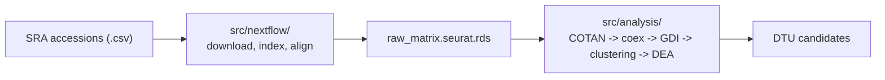

# sc-Isoform COTAN

[](https://github.com/ldelitala/sc-isoform-cotan/actions/workflows/lint.yaml)
[](LICENSE)

## A note to users

I would love to make every tool here accessible and usable for everyone, but
right now the main focus is the thesis goal, so user experience is not thought
out at all and the tools can be hard to navigate.

## What this is

This repository is the code behind a bachelor's thesis that asks whether
**differential transcript usage (DTU)** can be recovered from single-cell RNA-seq
data using **COTAN**, a co-expression method based on zero-count statistics.
COTAN is adapted here from gene level to **transcript (isoform) level**: a
cell-by-isoform count matrix is produced, then COTAN is run on it to detect,
within a parent gene, pairs of transcripts that switch their relative usage
across cell clusters. Those candidate pairs are the DTU tables the thesis
reports. The exact definition is in [`docs/dtu_methods.md`](docs/dtu_methods.md).

The thesis sources are at <https://github.com/ldelitala/cotan-dtu-thesis>; cite
this software with [`CITATION.cff`](CITATION.cff).

## Three tools in one

The repository is really three independent pieces that meet at one artifact (a
filtered cell-by-isoform matrix). Each has its own README; use the one that
matches what you want to do.

| Tool | What it is | Read |
| :--- | :--- | :--- |
| `src/nextflow/` | Nextflow: SRA accessions → cell-by-isoform Seurat matrix. The transcript "cheat" lives here. | [`src/nextflow/README.md`](src/nextflow/README.md) |
| `src/cotanisoform/` | The R package: every analysis stage as a documented function, plus the logging layer. | [`src/cotanisoform/README.md`](src/cotanisoform/README.md) |
| `src/analysis/` | The R drivers that compose the package into per-dataset runs and produce the DTU tables. | [`src/analysis/README.md`](src/analysis/README.md) |

## Data flow


```mermaid
graph LR
  A["SRA accessions (.csv)"] --> B["src/nextflow/<br/>download, index, align"]
  B --> C["raw_matrix.seurat.rds"]
  C --> D["src/analysis/<br/>COTAN -> coex -> GDI -> clustering -> DEA"]
  D --> E["DTU candidates"]
```

Two independent units meet at one artifact, an **unfiltered** transcript-level
Seurat matrix (`raw_matrix.seurat.rds`): `src/nextflow/` produces it, `src/analysis/`
consumes it and does its own QC clean-up.

## Quick start

Everything heavy runs on athena (the university machine). Create the R environment,
install the pinned COTAN and this repository's package once:

```bash
conda env create -f envs/analysis.yml     # R 4.5.3 + R libraries
conda activate cotanisoform-analysis
Rscript scripts/install_deps.R            # installs COTAN 2.13.1 @ be93aa8
R CMD INSTALL src/cotanisoform            # this repository's package
```

Then run one dataset config (the full recipe is in the tool READMEs):

```bash
Rscript src/analysis/run_all.R --config src/analysis/config/arrigoni.yaml
```

The cheap real check — resolve and validate every path without computing:

```bash
Rscript src/analysis/run_all.R --config src/analysis/config/arrigoni.yaml --dry-run
```

Add `--out-dir /tmp/scratch` to write to scratch and shadow configured inputs, so
the published tables are never overwritten. Only step `07_dtu.R` produces the
reported DTU tables.

## Repository layout

| Path | Role |
| :--- | :--- |
| `src/nextflow/` | Nextflow half: `main.nf`, `nextflow.config`, `modules/`, `subworkflows/`, `bin/` stage scripts. |
| `src/cotanisoform/` | The R package with the COTAN/Seurat/logging algorithms. Source of truth. |
| `src/analysis/` | Config-driven driver steps (`00`–`09`), one YAML per dataset + level. |
| `envs/` | Conda environments for athena (`analysis.yml`, `pipeline.yml`). |
| `scripts/` | `install_deps.R` (pins COTAN), `verify_dtu_parity.R` (parity gate), `collect_results.sh`. |
| `results/` | Curated published outputs (DTU tables, plots, logs). |
| `docs/` | Cross-cutting docs: `data.md`, `dtu_methods.md`, `TODO.md`. |

## Results

The reported DTU candidate tables and diagnostic plots are in
[`results/`](results/README.md). They can be re-checked against the stored COTAN
objects on athena:

```bash
Rscript scripts/verify_dtu_parity.R      # must print "3/3 cases reproduced exactly"
```

The three `dtu_shared.csv` / `dtu_exclusive_file{1,2}.csv` files in
`results/ding_cortex_2/tables/` are a **released** comparison computed from an
earlier candidate pair and are kept deliberately for the thesis appendix — step
`08` on the final tables does not reproduce them (see
[`docs/dtu_methods.md`](docs/dtu_methods.md)).

## Documentation

Three cross-cutting docs, one line each:

| Doc | Covers |
| :--- | :--- |
| [`docs/data.md`](docs/data.md) | The two datasets, accessions/assemblies, re-download; athena layout, access + tunnel, what is safe to delete. |
| [`docs/dtu_methods.md`](docs/dtu_methods.md) | The exact DTU definition, the p-value model, the mapping to the published tables. |
| [`docs/TODO.md`](docs/TODO.md) | Open backlog (currently: per-cluster isoform-proportion plots for the headline candidates). |

Everything else sits next to the tool it documents: `src/nextflow/README.md`,
`src/cotanisoform/README.md`, `src/analysis/README.md`, `envs/README.md`,
`results/README.md`, `CONTRIBUTING.md` (dev workflow).

## Citation

If you use this software, cite the associated bachelor's thesis — see
[`CITATION.cff`](CITATION.cff).

<!-- TODO(supervisor): add ORCID iDs and/or a DOI here when available. -->

## Licence

[GPL-3.0](LICENSE).

## Acknowledgements

Supervisors: Prof. Silvia Galfré and Prof. Corrado Priami, University of Pisa,
Department of Computer Science.
