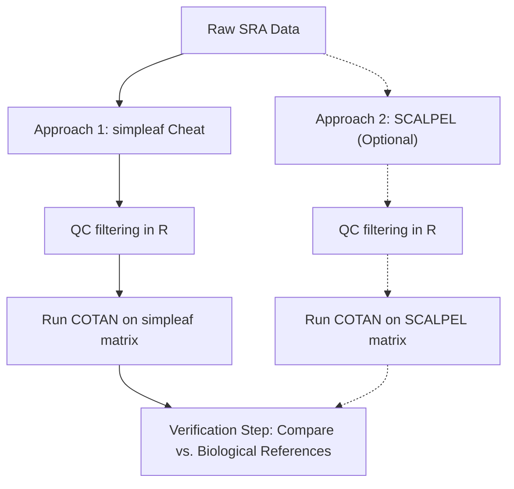

# 6. Downstream Analysis & COTAN Validation

This document outlines the downstream analysis plan using the **COTAN** algorithm and the validation strategy comparing simpleaf's index cheat and SCALPEL's isoform counts.

---

## 1. COTAN (CO-expression Table Analysis)

COTAN is a statistical method designed to analyze single-cell RNA-seq datasets by focusing on gene-gene co-expression. 
* **Handling Sparsity**: COTAN is optimized for zero-inflated (sparse) matrices. It uses a clean mathematical model that analyzes the probability of gene co-occurrence (co-expression) based on cell detection rates without relying on heavy data normalization.
* **Application on Transcripts**: For this thesis, COTAN is applied to transcript-level matrices (where rows represent transcript isoforms instead of combined genes). This tests if COTAN's mathematical model can identify transcript-transcript co-expression networks and resolve isoform-specific signatures.

### Input Format
COTAN expects a **raw, filtered counts matrix** as input:
* Rows: Ensembl Transcript IDs.
* Columns: Cell Barcodes.
* Values: Raw UMI counts.
* Output: Spliced/unspliced co-expression tables, cell clusters, and markers.
## 2. Verification & Biological Knowledge Comparison

To verify if COTAN can resolve isoform-aware results from 3'-biased short-read matrices, we will compare the downstream results directly against **established biological knowledge** of the target organisms:

### The Primary Verification Step
Instead of validating COTAN against other computational tools, we will verify its outputs using reference databases (such as Ensembl, RefSeq, GENCODE) and existing literature:
1. **Co-expression Authenticity**: Check if transcripts that COTAN identifies as highly co-expressed correspond to known co-regulated isoforms or functional protein-protein interaction networks.
2. **Cell Clustering Profiles**: Check if the clusters resolved by transcript-level COTAN runs align with established cell-type markers and biological tissue organization details.
3. **Marker Gene Robustness**: Verify if marker transcripts identified by COTAN correspond to known markers in brain and cortex development (e.g. using the reference knowledge of the Linnarsson Lab mouse brain atlas).

### Optional: SCALPEL Exploratory Path
If time permits, we will explore running the **SCALPEL** pipeline (Single-Cell Isoform Quantification) on the same raw datasets.
* **Goal**: Obtain a cell-by-isoform count matrix using SCALPEL's dedicated splicing quantification algorithm.
* **Analysis**: Run COTAN on this matrix and evaluate if utilizing a specialized splicing quantification pipeline changes or improves COTAN's ability to resolve isoform relationships compared to the simpleaf identity matrix cheat.

