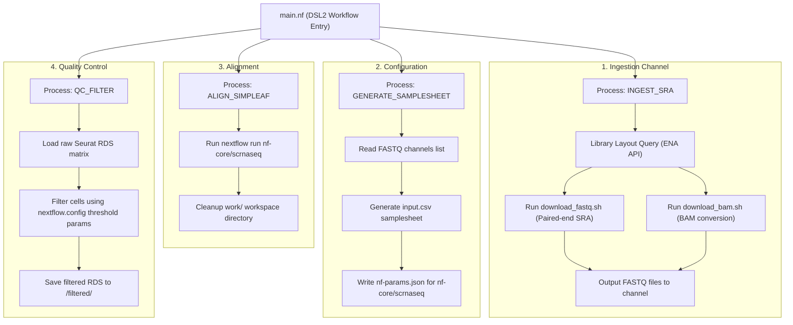

# 7. Script & Pipeline Architecture

This document describes the design, process interfaces, and workflow execution flow for the single-cell RNA-seq processing pipeline. 

The pipeline is coordinated by the **Nextflow DSL2** pipeline engine. Execution parameters and limits are declared in [nextflow.config](file:///home/deli/athena_mount/nextflow.config), while the flow logic is defined in [main.nf](file:///home/deli/athena_mount/main.nf).

---

## 1. Master Pipeline Flow

The execution workflow coordinates four main processes using native Nextflow channels:

---

## 2. Process Specifications & Interfaces

### A. Process: `INGEST_SRA`
Handles downloading of raw sequences from the Sequence Read Archive (SRA) and formats them into standard fastq pairs.
* **Inputs**:
  * `srr_id`: SRA run ID (e.g. `SRR11947578`).
  * `dataset`: Target dataset folder name.
* **Directives**:
  * `maxForks`: Capped by configuration (default = 6 parallel SRR IDs).
  * `cpus`: Threads allocated per download job (default = 12 threads).
* **Helper Workers**:
  * **[ingest_srr.sh](file:///home/deli/athena_mount/bin/ingest_srr.sh)**: Root ingestion coordinator. Determines layout and runs appropriate downloader.
  * **[download_fastq.sh](file:///home/deli/athena_mount/bin/download_fastq.sh)**: Downloads standard paired-end layout submissions.
  * **[download_bam.sh](file:///home/deli/athena_mount/bin/download_bam.sh)**: Downloads, extracts, converts, and compresses BAM-based submissions.
* **Outputs**: Tuple containing the `srr_id` and paths to `_1.fastq.gz` and `_2.fastq.gz` files.

### B. Process: `GENERATE_SAMPLESHEET`
Gathers all downloaded fastq file paths and constructs configuration parameters.
* **Inputs**:
  * `dataset`: Dataset directory name.
  * `genome`: Reference genome code.
  * `protocol`: 10x version protocol.
  * `fastq_pairs`: List of all paths generated by `INGEST_SRA`.
* **Outputs**:
  * `input.csv`: Samplesheet referencing paths to fastq files.
  * `nf-params.json`: Configuration arguments for nf-core/scrnaseq.

### C. Process: `ALIGN_SIMPLEAF`
Wraps the execution of the `nf-core/scrnaseq` pipeline inside its unique run workspace.
* **Inputs**:
  * `dataset`: Target dataset name.
  * `samplesheet`: Path to `input.csv`.
  * `params_json`: Path to `nf-params.json`.
* **Directives**:
  * `cpus`: Dedicated core count limit (default = 72 cores).
  * `memory`: Dedicated memory limit (default = 2.0 TB).
* **Execution**:
  * Runs the downstream pipeline `nextflow run nf-core/scrnaseq` with low scheduling priorities.
  * Cleans up the nested `work/` folder upon success to conserve shared storage space.
* **Outputs**: Path to the raw Seurat matrix `combined_raw_matrix.seurat.rds`.

### D. Process: `QC_FILTER`
Executes R quality control cell-filtering using parameters passed from the configuration.
* **Inputs**:
  * `dataset`: Target dataset name.
  * `raw_matrix_rds`: Path to the raw Seurat matrix RDS file.
* **Execution**:
  * Runs [filter_matrix.R](file:///home/deli/athena_mount/bin/filter_matrix.R) using parameters.
* **Outputs**: Filtered Seurat/SingleCellExperiment RDS matrix file written to the `filtered/` output folder.
