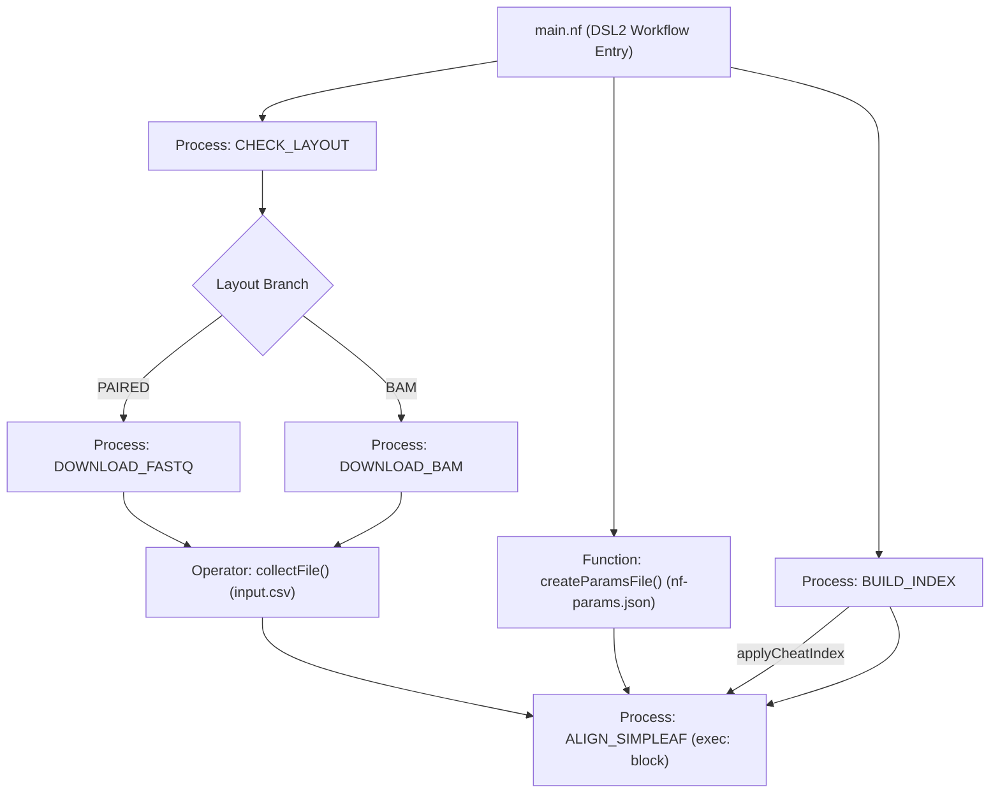

# 7. Script & Pipeline Architecture

This document describes the design, process interfaces, and workflow execution flow for the single-cell RNA-seq processing pipeline. 

The pipeline is coordinated by the **Nextflow DSL2** pipeline engine. Execution parameters and limits are declared in [nextflow.config](../src/pipeline/nextflow.config), while the flow logic is defined in [main.nf](../src/pipeline/main.nf).

---

## 1. Master Pipeline Flow

The execution workflow coordinates the data flow using native Nextflow channels, operators, and processes:

---

## 2. Process Specifications & Interfaces

### A. Process: `CHECK_LAYOUT`
Queries the EBI ENA API to retrieve the layout type for a given accession ID (Single-End/Paired-End or BAM).
* **Inputs**: `srr_id` (SRA accession code).
* **Execution**: Natively triggers a curl call against the ENA API and extracts the library layout field.
* **Outputs**: A tuple containing `srr_id` and the layout type string (`stdout`).

### B. Processes: `DOWNLOAD_BAM` & `DOWNLOAD_FASTQ`
Download sequence data and format/extract them to standard compressed fastq pairs.
* **Inputs**:
  * `srr_id`: SRA run ID to fetch.
  * `dataset`: Target dataset name.
* **Directives**:
  * `maxForks`: 4 (concurrency limit on shared resources).
  * `cpus`: 2 (the `process` default — `DOWNLOAD_BAM`/`DOWNLOAD_FASTQ` carry no `cpus` override).
  * `scratch`: `'/dev/shm'` (stages intermediate files completely in RAM).
  * `storeDir`: Automatically caches completed fastq files.
* **Outputs**: A tuple containing `srr_id` and the two paths to the generated FASTQ files (`_1.fastq.gz`, `_2.fastq.gz`).

### C. Index Preparation & Configuration Generation (Workflow Operators & Modules)
Instead of manual setups, reference builds and config files are generated natively:
* **Index Compilation (`BUILD_INDEX`)**: Automatically downloads genome sources from Ensembl and compiles indices using the Simpleaf Singularity container if they do not exist.
* **Transcript Identity Customizer (`applyCheatIndex`)**: Natively modifies `t2g_3col.tsv` to establish identity mapping and deletes gene symbols files.
* **Samplesheet (`input.csv`)**: Generated using the Nextflow `.collectFile()` operator. Gathers all FASTQ paths and builds a CSV file stored in the preprocessing run directory (`params.preprocessing_dir`).
* **Parameters (`nf-params.json`)**: Constructed via the `writeParamsJson()` helper function which creates a JSON config file mapping Piscem index and parameter configurations.

### D. Process: `ALIGN_SIMPLEAF`
Wraps the execution of the `nf-core/scrnaseq` pipeline using the `nf-cascade` pattern via a native `exec:` block.
* **Inputs**:
  * `dataset`: Target dataset name (type: `val`).
  * `input_csv`: Absolute path to `input.csv` (type: `val`).
  * `nf_core_params_json`: Absolute path to `nf-params.json` (type: `val`).
  * `index_dir`: Absolute path to compiled index (type: `path`).
* **Directives**:
  * None. Runs natively as Groovy code bypassing containerized worker-node staging.
* **Execution**:
  * Natively sets up the run directory (`runs/${dataset}_simpleaf`) and generates `custom.config` overriding the simpleaf container to version `0.24.1--hd612981_0`.
  * Triggers `nextflow run nf-core/scrnaseq` using the Java `Process.execute()` interface, unsetting `NXF_OPTS`/`NXF_CONFIG_FILES` and exporting `NXF_SYNTAX_PARSER=v1`.
  * Consumes logs/outputs natively in real time, waits for completion, and throws an error on non-zero exit codes.
  * Safely cleans up the child pipeline's `work/` directory upon success.
* **Outputs**: Path to the raw Seurat matrix relative to the task work directory (type: `path`). The file `raw_matrix.seurat.rds` is staged to both the target `unfiltered_dir` and the local `task.workDir`.
