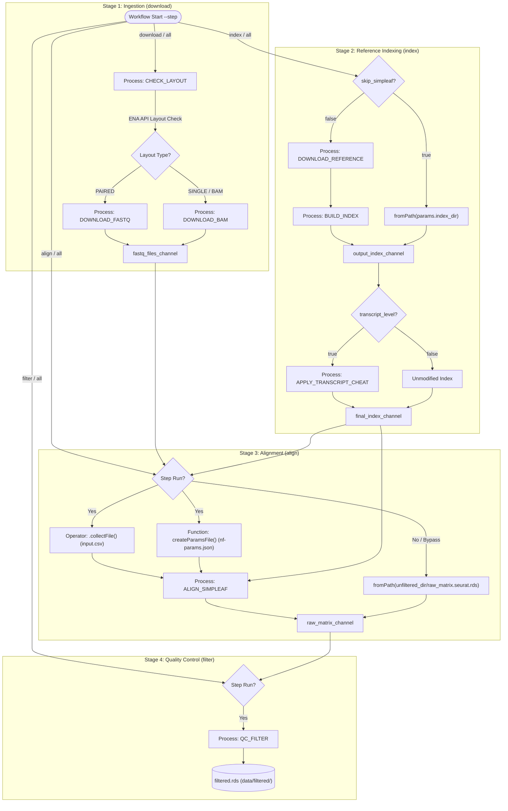

# Pipeline Architecture & Workflows

This document provides a technical specification and workflow overview of the single-cell RNA-seq pre-processing pipeline. The pipeline uses Nextflow DSL2 to orchestrate data ingestion, reference compilation, transcript-level alignment, and quality control filtering.

---

## 1. High-Level Workflow Overview

The pipeline is organized into four main stages controlled by the `--step` parameter (`all`, `download`, `index`, `align`, `filter`). 

1. **Ingestion (`download`)**: Downloads public SRA accessions, queries library layout dynamically from the ENA API, and downloads either raw BAMs (single-end / BAM layout) or SRA files (paired-end layout) to reconstruct compressed FASTQ pairs.
2. **Indexing (`index`)**: Fetches species-specific genome FASTA and annotation GTF files directly from Ensembl (supporting automatic fallback configuration), builds a Piscem index using `simpleaf index` inside a container, and optionally maps transcripts to themselves (transcript cheat) to produce isoform-level mappings.
3. **Alignment (`align`)**: Natively constructs samplesheets (`input.csv`) and configuration parameters (`nf-params.json`), then spawns a child pipeline run of `nf-core/scrnaseq` (v4.1.0) under local high-performance settings.
4. **Filtering (`filter`)**: Runs a modular R pipeline checking UMI counts, feature ranges, and mitochondrial transcript representation to generate clean count matrices for downstream COTAN evaluations.

---

## 2. Mermaid Workflow Steps

---

## 3. Process Breakdown

### 1. `CHECK_LAYOUT`
* **Purpose**: Dynamically queries the EBI ENA REST API to check whether a given SRA Run ID contains paired-end sequencing layout or single-end/BAM files.
* **Inputs**:
  * `srr_id` (`val`): String representing the SRA Run Accession.
* **Outputs**:
  * `tuple val(srr_id), stdout`: Accession ID paired with API output (`SINGLE` or `PAIRED`).
* **Requirements & Directives**:
  * Requires `curl` executable.
  * Directives: `errorStrategy 'retry'`, `maxRetries 3`.

### 2. `DOWNLOAD_BAM`
* **Purpose**: Retrieves single-end or TenX BAM datasets via `prefetch`, extracts them into raw FASTQs using `bamtofastq`, and moves/renames files to standard paired layout outputs.
* **Inputs**:
  * `srr_id` (`val`): SRA Run Accession.
  * `dataset_dir` (`val`): Path to output dataset directory.
* **Outputs**:
  * `tuple val(srr_id), path("${srr_id}_1.fastq.gz"), path("${srr_id}_2.fastq.gz")`: Completed, compressed FASTQ read pairs.
* **Requirements & Directives**:
  * Requires SRA Toolkit (`prefetch`) and `bamtofastq`.
  * Directives: `storeDir` dynamic caching, `scratch '/dev/shm'` (executes file operations in RAM disk), `errorStrategy 'retry'`, `maxRetries 2`.

### 3. `DOWNLOAD_FASTQ`
* **Purpose**: Retrieves paired-end SRA datasets via `prefetch`, extracts FASTQ files using `fasterq-dump`, and compresses output files.
* **Inputs**:
  * `srr_id` (`val`): SRA Run Accession.
  * `dataset_dir` (`val`): Path to output dataset directory.
* **Outputs**:
  * `tuple val(srr_id), path("${srr_id}_1.fastq.gz"), path("${srr_id}_2.fastq.gz")`: Compressed FASTQ read pairs.
* **Requirements & Directives**:
  * Requires SRA Toolkit (`prefetch`, `fasterq-dump`) and `pigz` compressor.
  * Directives: `storeDir` dynamic caching, `scratch '/dev/shm'` (RAM staging), `errorStrategy 'retry'`, `maxRetries 2`.

### 4. `DOWNLOAD_REFERENCE`
* **Purpose**: Downloads the primary DNA FASTA genome file and Ensembl GTF annotation file. Resolves species URLs dynamically if not pre-configured.
* **Inputs**:
  * `reference_dir` (`val`): Output path where downloads are saved.
  * `reference_urls` (`val`): Configured lookup dictionary of genome assemblies.
  * `genome_species` (`val`): Species folder string.
  * `genome_assembly` (`val`): Assembly code.
  * `ensembl_release` (`val`): Release number.
* **Outputs**:
  * `tuple path("*.fa.gz"), path("*.gtf.gz")`: Output genome sequences and annotation pair.
* **Requirements & Directives**:
  * Requires `wget` and internet connectivity.
  * Directives: `storeDir` dynamic caching.

### 5. `BUILD_INDEX`
* **Purpose**: Generates a standard `simpleaf` Piscem index folder from genome sequence and annotation inputs.
* **Inputs**:
  * `tuple path(fasta_file), path(gtf_file)`: Genome reference sequences.
  * `gene_index_dir` (`val`): Path to write the output index.
* **Outputs**:
  * `path(file(gene_index_dir).getName()), emit: gene_index_dir`: Output compiled index directory.
* **Requirements & Directives**:
  * Requires Singularity container: `simpleaf:0.22.0--hd612981_0`.
  * Directives: `storeDir` pointing to the parent folder of the index directory.

### 6. `APPLY_TRANSCRIPT_CHEAT`
* **Purpose**: Modifies the index to map transcripts to themselves. Bypasses gene-level aggregation, producing transcript/isoform-level matrix outputs.
* **Inputs**:
  * `path(index_dir)`: Compiled `simpleaf` gene-level index path.
* **Outputs**:
  * `path("transcript_index"), emit: transcript_index_dir`: Modified transcript-level index directory.
* **Requirements & Directives**:
  * Executes a Nextflow head-node sanity check on the index contents (`ref_core.hash`, `pos.bin`, `t2g_3col.tsv`).
  * Requires `awk` for t2g mapping edits.
  * Directives: `storeDir` caching.

### 7. `ALIGN_SIMPLEAF`
* **Purpose**: Invokes the `nf-core/scrnaseq` pipeline wrapper via a child Nextflow instance (using the `nf-cascade` pattern). Resolves transcript counts to a Seurat matrix.
* **Inputs**:
  * `input_csv` (`val`): Path to compiled samplesheet (`input.csv`).
  * `nf_core_params_json` (`val`): Path to custom nextflow params config (`nf-params.json`).
  * `index_dir` (`path`): Path to target transcript-level Piscem index.
* **Outputs**:
  * `path("${params.unfiltered_dir}/raw_matrix.seurat.rds"), emit: raw_seurat_matrix`: Computed raw Seurat RDS matrix.
* **Requirements & Directives**:
  * Executes via a native Groovy `exec:` block on the launch host.
  * Bypasses container staging by unsetting standard Nextflow environment variables (`NXF_OPTS`, `NXF_CONFIG_FILES`).
  * Copies outputs using `java.nio.file.Files.copy` and cleans up intermediate `work/` structures.

### 8. `QC_FILTER`
* **Purpose**: Runs cell-quality filtering (counts, features, mitochondrial reads) using a modular R script pipeline.
* **Inputs**:
  * `raw_matrix_rds` (`path`): Unfiltered raw count matrix file.
  * `mt_transcripts` (`path`): Path to the list of mitochondrial transcript identifiers.
* **Outputs**:
  * `path("${params.filtered_dir}/filtered.rds"), emit: filtered_matrix`: QC-filtered Seurat/SingleCellExperiment RDS matrix.
* **Requirements & Directives**:
  * Requires R environment with `optparse` and `Matrix` packages.
  * Directives: `errorStrategy` custom handler, retry on memory failure (OOM code 137/140/143) with exponential memory scaling.
