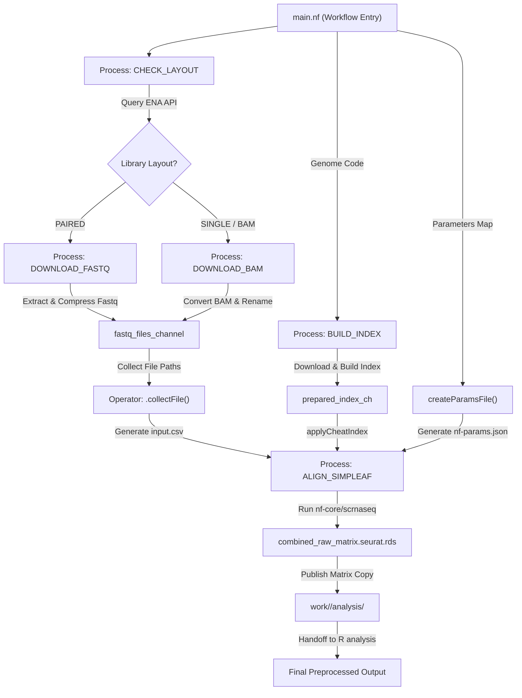

# Pipeline Workflow Diagram

This document provides a visualization and explanation of the data processing flow through the Nextflow DSL2 orchestration pipeline.

## 1. Flow Diagram (Mermaid)

## 2. Stage Breakdown

### Stage 1: Ingestion (`ingest.nf`)
- **`CHECK_LAYOUT`**: Queries the ENA API to verify whether the SRA ID is Paired-End, Single-End, or native BAM format.
- **`DOWNLOAD_FASTQ` / `DOWNLOAD_BAM`**: Downloads data directly to RAM disk (`/dev/shm`), processes/extracts FASTQs, compresses them via `pigz`, and caches the final outputs in `data/datasets/`.

### Stage 2: Configuration & Index Preparation (`main.nf` & `index.nf`)
- **`BUILD_INDEX`**: Automatically checks for the presence of the Piscem simpleaf index. If missing, it downloads primary assembly FASTA and GTF references from Ensembl and compiles the index inside the Simpleaf container.
- **`applyCheatIndex()`**: Native Groovy mapper executed post-build to establish transcript identity mapping on `t2g_3col.tsv` and delete mapping helper files.
- **`collectFile()`**: Natively gathers FASTQ file pairs and generates `input.csv` (samplesheet) inside the nested execution folder.
- **`createParamsFile()`**: Generates `nf-params.json` for child nextflow configuration containing parameters like cellranger indexes, protocols, etc.

### Stage 3: Alignment (`align.nf`)
- **`ALIGN_SIMPLEAF`**: Spawns a child `nf-core/scrnaseq` pipeline run inside `work/<dataset>/pipeline/results/preprocessing/`.
- **Publish raw matrix**: Writes the unfiltered concatenated matrix to `work/<dataset>/analysis/raw_matrix.seurat.rds` (the `unfiltered_dir`), which is the handoff to the R analysis.

### Stage 4: Downstream R analysis (`src/analysis/`)
- The `src/analysis/` steps take `raw_matrix.seurat.rds`, do their own Seurat
  clean-up and QC against the published GEO barcode lists, then run COTAN. QC
  filtering is not part of the Nextflow half.
